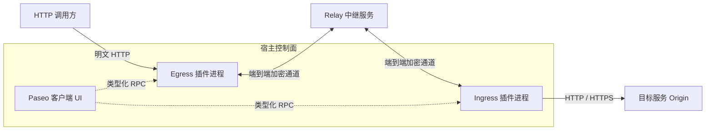

# Paseo HTTP Tunnel 架构与协议设计

本文档阐述 Paseo HTTP Tunnel 的技术目标、系统架构、流控机制、安全模型与生命周期设计。

---

## 1. 目标与设计原则

HTTP Tunnel 用于在受信任的 Paseo Host 之间建立面向固定 HTTP/HTTPS 服务的端到端加密通道：
- **受控访问**：面向开发测试、内部运维面板、专用 API 及私有大模型服务等授权工作负载。
- **职责分工**：**Ingress** 贴近目标服务 Origin 运行；**Egress** 提供本地 HTTP 监听端口，供客户端透明调用。
- **独立于应用会话**：不依赖 Workspace 或特定的 Agent 运行状态；后台 daemon 与插件进程维持服务可用性。
- **明确的技术边界**：不支持任意网段扫描、任意 TCP 代理、CONNECT 隧道或 WebSocket Upgrade；目标服务由 Ingress 规则固定指定。

### 核心规格与参数速查

| 指标维度 | 规格参数 | 说明 |
| :--- | :--- | :--- |
| **流控窗口** | $8 \times 64\text{ KiB}$ | 双向未确认数据上限；最早块 ACK 后立即滑动。 |
| **通道复用模型** | 单通道单请求 (1:1) | 每个 HTTP 请求独占一条 E2EE 加密通道与 Relay 连接。 |
| **预连接池** | 最多 2 条空闲通道 | 预先完成 Relay 与 E2EE 握手；空闲 30s 自动过期回收。 |
| **连接与并发上限** | 128 / 256 | 每个 Runtime 最多 128 条数据通道；每个 Egress 最多 256 个并发 Socket。 |
| **超时保护** | 10s / 8s | HTTP 请求头接收超时 10s；连通性探测超时 8s。 |
| **配置存储** | `0600` 权限 JSON | 独立存储于 `$PASEO_HOME/tunnel/config.json`，原子刷盘更新。 |

---

## 2. 总体架构拓扑

系统区分**控制面**与**数据面**：数据流不经过宿主控制信道，但插件 RPC 处理和数据面逻辑仍运行在同一个插件子进程中：



### 控制面与数据面分离

- **控制面 (Control Plane)**：
  - 基于 React Native 构建，嵌于 Paseo 宿主应用内。
  - 通过 Paseo 类型化 RPC 管理配置、查看运行时状态、触发密钥轮换。
  - 跨 Host 配置**仅通过 Route Offer 的显式复制与导入**实现，两端无需在控制面上产生跨机直接依赖。
- **数据面 (Data Plane)**：
  - 由独立的 Node.js 子进程直接管理 HTTP Listener、WebSocket 控制连接和加解密引擎。
  - 数据传输完全由插件进程与 Relay 直接交互，**数据流量不流经 Paseo 桌面客户端或主 Daemon 控制信道**。
- **权限与宿主边界**：
  - 插件作为受信任扩展运行，继承宿主 Daemon 用户的操作系统权限。
  - 进程隔离用于资源与生命周期管理，不构成操作系统的权限沙箱。

---

## 3. 配置模型与安全凭据

| 实体对象 | 字段构成 | 作用域与安全性 |
| :--- | :--- | :--- |
| **Tunnel Identity** | Curve25519 密钥对 | 独立于 Paseo 宿主身份；Egress 通过 Offer 固定 Ingress 公钥，使用临时客户端密钥协商 E2EE 通道，并以 Route Secret 获得路由访问权限。 |
| **Ingress 规则** | 规则名、启用状态、固定 Origin、Route ID 与 Secret | Origin 仅包含协议、主机与端口（不含 Path/Query/Auth），避免重写篡改。 |
| **Route Offer** | Relay 地址、公钥、Route ID/Secret、推荐端口 | 跨主机连接凭证；包含端到端解密所需参数，必须通过可信信道分发。 |
| **Egress 规则** | 规则名、监听端口、绑定的 Offer、认证模式与 Token 哈希 | 负责本地 Listener 绑定及入口访问鉴权。 |
| **Access Token** | 高随机度令牌（存储 SHA-256 哈希） | 仅用于客户端访问指定 Egress；不授予任何 Paseo 控制权限。 |

> [!IMPORTANT]
> - **Route Offer 是连接凭据**：其内容属于敏感信息。导出时在界面中脱敏显示，点击复制时获取完整 JSON。
> - **凭据生命周期解耦**：轮换 Ingress Route Secret 会使已派发的 Offer 失效，需在各 Egress 重新导入；轮换 Egress Access Token 仅影响外部调用方，无需重新生成 Offer。

---

## 4. 传输协议与流控机制

### 4.1 通道生命周期与预连接池

1. **通道领取**：客户端向 Egress 发起 HTTP 请求并通过前置认证后，优先从预连接池领取一条已完成 Relay 和 E2EE 握手的空闲通道；若无可用通道则即时新建。
2. **路由鉴权**：Egress 锁定 Offer 内绑定的 Ingress 公钥，在加密通道内发送 Route ID 与 Secret 进行对端校验。
3. **请求转发**：Ingress 验证路由通过后，向本地配置的 Origin 发起标准 HTTP/HTTPS 请求。
4. **资源释放**：单个请求处理完毕或任一侧异常断开时，立即销毁通道及底层连接，**不进行隐式静默重试**（防止非幂等 POST 重复提交）。

```text
Egress 启动 / 认证请求 ──> 异步预建 (最多 2 条) ──> Relay & E2EE 握手完成 ──> 进入池中
                                                                  │ (30s 无人领取)
                                                                  ▼
                                                             超时安全销毁
```

### 4.2 滑动窗口流控算法

为了兼顾高吞吐传输与低内存占用，HTTP Tunnel 实现了基于 ACK 的双向滑动窗口机制：

- **窗口容量**：每个方向最多允许 **8 个未确认块**（每块最大 64 KiB，最大在途应用数据为 512 KiB）。
- **滑动策略**：接收端写入下游后回复确认帧；若 `write()` 返回 `false`，则等待 `drain` 后确认。**发送端只要收到最旧块的 ACK 即推进窗口**，无需等待整批确认，大幅消除 SSE 流和文件上传中的卡顿。
- **内存零落盘**：请求与响应 Body 采用分块流式直推，不进行内存全量聚合，严禁向本地磁盘写入临时数据。

---

## 5. HTTP 语义与网络边界

### 5.1 字段处理规范

- **保留与透传**：完整保留标准 HTTP Method、Path、Query、端到端标头及重复响应头。
- **过滤与剥离**：自动移除 Hop-by-Hop 头（如 `Connection`、`Keep-Alive`、`Transfer-Encoding` 等）。
- **标头重建**：
  - Ingress 将请求的 `Host` 头自动重写为目标 Origin 的真实主机名与端口。
  - 先剥离传入的 `X-Forwarded-For`、`X-Forwarded-Proto` 与 `X-Forwarded-Host`，再按 Egress 记录的调用方地址、协议和 Host 重建。
- **HTTPS 支持**：目标为 HTTPS 服务时，严格校验证书信任链；不支持跳过证书验证。

### 5.2 认证隔离模式

| 模式 | Egress 鉴权校验 | 转发至内网服务 | 适用场景 |
| :--- | :--- | :--- | :--- |
| **Header** | `X-Paseo-Access-Token` | 剥离 Tunnel Token，**保留**业务自带的 `Authorization` | 内网服务本身需要 Bearer Token 认证。 |
| **Bearer** | `Authorization: Bearer` | 剥离用于 Tunnel 鉴权的 `Authorization` 头 | 简单客户端或不想添加自定义 Header。 |
| **None** | 不校验任何 Token | 所有标头按标准 HTTP 规范透明转发 | 仅限内网完全受信任的受限网段。 |

> [!NOTE]
> Egress 默认仅监听 `127.0.0.1` 本地回环接口。当管理员明确配置为监听全网卡（`0.0.0.0`）且暴露至外部网络时，强烈建议开启 Access Token 鉴权，并在前面挂载具备 TLS 证书终结的反向代理（如 Nginx / Caddy）。

---

## 6. 状态诊断与失败语义

### 6.1 链路连通性检查

HTTP Tunnel 维护两套独立的状态指标：
1. **进程与监听状态**：监控本地 Listener 与 Relay 控制连接的存活情况。
2. **主动连通性探测 (Connectivity Dot)**：
   - 页面打开时定期执行轻量级 `HEAD /` 探测。
   - Ingress 确认 Relay 在线且 Origin 返回任意有效 HTTP 状态码。
   - Egress 验证 Listener $\rightarrow$ Relay $\rightarrow$ E2EE $\rightarrow$ Ingress $\rightarrow$ 目标服务的全链路可达。
   - **语义说明**：任意 HTTP 状态码（包含 401、403、404）均证明链路连通；绿点仅代表链路可达，不代表业务鉴权通过。

### 6.2 异常响应状态码映射

| 失败场景 | 响应行为 | 说明 |
| :--- | :--- | :--- |
| **Token 缺失或校验失败** | `HTTP 401 Unauthorized` | 鉴权失败，立即阻断。 |
| **Egress 数据通道容量耗尽** | `HTTP 503 Service Unavailable` | 已达 128 条通道上限且无预建通道可领取时拒绝请求。 |
| **Relay 断开 / 密钥不匹配 / 目标不可达** | `HTTP 502 Bad Gateway` | 若响应头尚未发出则返回 502；若已开始流式传输则强行断开连接。 |
| **上游业务服务报错** | 透传原始状态码（如 4xx / 5xx） | 完整保留上游业务响应头和错误正文。 |
| **本地端口冲突** | 启动配置抛错，界面标红 | 不覆盖现有配置，保留故障前状态。 |

数据面将路由或上游连接失败转换为固定的 502 响应；响应已开始时关闭连接。状态 RPC 不返回密钥或 Token 哈希，快速验证预览会替换原样回显的输入令牌。这些处理不代表所有 RPC 错误或日志都经过通用脱敏。
