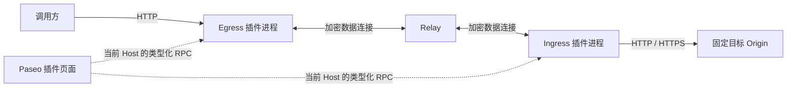

# HTTP Tunnel 插件设计

## 目标与范围

HTTP Tunnel 将一个 Egress HTTP 监听端口连接到一个固定的内网 HTTP/HTTPS 服务，支持请求体、响应体、二进制数据及 SSE 的流式转发。插件不依赖 Workspace 或 Agent，由 Paseo 承载安装、进程生命周期、控制连接和客户端页面。

一个 Ingress 对应一个目标 Origin，可供多个 Egress 使用。一个 Egress 持有一份 Route Offer，只连接一个 Ingress。同一 Host 可同时承担两个角色，数据仍经过 Relay。

## 架构

- **控制面**：React Native 页面通过 Paseo 的连接调用插件 RPC，管理所选 Host 的配置、凭据和状态。跨 Host 配置只通过 Route Offer 复制与导入完成。
- **数据面**：独立 Node.js 子进程直接持有 HTTP listener、WebSocket 和加密通道，代理流量不经过 App 或控制面 RPC。
- **宿主边界**：Paseo 管理侧边栏入口、Host 选择、主题、模块编译及进程启停。插件管理完整页面、网络资源与独立配置。进程隔离不等于权限沙箱，插件代码属于受信任代码。

关闭 App 不影响代理；运行所需条件是两端 daemon、插件进程、Relay 和目标服务均可达。

## 配置模型与凭据

| 对象 | 职责与边界 |
| --- | --- |
| Tunnel identity | 独立的服务标识和加密密钥对；不复用 Paseo 控制身份。 |
| Ingress | 名称、启用状态、固定 Origin、route ID 和 route secret。Origin 不含路径、查询参数或用户信息。 |
| Route Offer | Relay 地址、Tunnel 公钥、route ID/secret、来源显示名称与建议端口。它是含密钥的 JSON 能力凭据，不是加密文件。 |
| Egress | 名称、启用状态、监听地址与端口、Route Offer、认证模式及 Token 哈希。 |
| Access Token | 只授权访问单个 Egress，不授予 Paseo 控制权限；明文仅由创建或轮换操作返回。 |

Route Offer 的名称和建议端口是导出时的快照，不建立实时跨 Host 依赖。导入时不要求 Ingress 在线。轮换 route secret 后需手动替换所有相关 Egress 的 Offer；删除 Ingress 不删除远端 Egress。轮换 Access Token 不影响 Route Offer。

## 请求与流控

1. Egress 验证 HTTP 请求和访问凭据。
2. 每个请求建立一条 Relay 数据连接及 E2EE 通道；Ingress 通过共享 Relay 控制连接接入该请求。
3. Egress 固定 Route Offer 中的 Ingress 公钥。Ingress 在加密通道内验证 route ID 和 secret，再请求本地配置的 Origin。
4. 双向传输请求与响应元数据、二进制数据块和确认帧；请求完成或任一侧断开时释放关联资源，不自动重试。

每条通道仅承载一个 HTTP 请求。`request.head` / `response.head` 传递元数据，二进制帧承载 Body，`request.ack` / `response.ack` 提供双向流控，结束帧标记流结束。协议校验帧顺序和确认字节数。

每个方向最多允许 8 个未确认的 64 KiB 数据块。窗口耗尽时暂停上游读取；接收端处理下游写入及 `drain` 后确认。该窗口约束未确认的应用数据，不代表整个进程或网络栈的内存上限。Body 不整体聚合或落盘。

每个 Ingress/Egress runtime 最多持有 128 个数据连接；每个 Egress 最多接受 256 个 HTTP socket，未完成请求头限时 10 秒。SSE 随响应数据流转发，不等待整个响应结束。

## HTTP 与安全边界

外部调用只能提供 method、origin-form path、query、headers 和 Body，不能覆盖目标 Origin。保留端到端字段及重复响应头，移除 hop-by-hop 字段与 `Connection` 指定的字段。Ingress 按目标重建 `Host`，并按 Egress 观察到的调用信息重建 `X-Forwarded-*`。目标 HTTPS 使用正常证书验证。

| 认证模式 | Egress 校验 | 转发到内网服务 |
| --- | --- | --- |
| Header | `X-Paseo-Access-Token` | 移除 Tunnel Token，保留业务 `Authorization`。 |
| Bearer | `Authorization: Bearer` | 移除用于 Tunnel 认证的 `Authorization`。 |
| None | 不校验 Token | 按普通 HTTP 字段规则转发。 |

Relay 转发密文，可观察连接标识、时序和长度，不能读取 HTTP 内容或 route secret。Access Token 以 SHA-256 哈希保存，凭据比较使用恒定时间比较。普通状态 RPC 不返回 Token、哈希、Offer 或私钥。

监听默认绑定 loopback，新建 Egress 默认无认证；修改已有 Egress 时保留其认证模式。全部网卡需用户主动选择，界面说明网络暴露范围。Egress 不终止 TLS；公网 HTTPS 由外部反向代理提供，链路加密不覆盖调用方到 Egress 的明文 HTTP 段。

## 持久化与生命周期

配置保存在 `$PASEO_HOME/tunnel/config.json`，默认使用 `~/.paseo/tunnel/config.json`。文件权限为 `0600`，写入通过同目录临时文件、同步刷盘和原子重命名完成。文件包含 route secret 与 Tunnel 私钥，应作为敏感数据备份。

配置变更串行执行；创建、修改、删除和凭据轮换采用独立 RPC。需要启动 runtime 的变更在启动成功后持久化；失败保留已保存配置，必要时尝试恢复原 listener。恢复失败会体现在运行状态中。

启动时读取配置并恢复启用的规则；Ingress 控制连接断开后自动重连。禁用、删除或重载会关闭受影响的连接，允许中断活动请求。宿主调用插件 cleanup 后释放 listener、HTTP 请求、WebSocket 和定时器，不要求重启主 daemon。

## 页面与验证交互

侧边栏入口为 **HTTP Tunnel**，页面按 Ingresses、Egresses 排列。用户在 Ingress 页面添加服务并复制 Offer，在 Egress 页面导入 Offer、选择监听范围与认证方式。表单显示来源与建议端口，失败保留输入，管理操作按条目展开。

Egress 的请求面板生成可复制的 curl，支持 GET、POST、路径、查询参数及 JSON 请求体。Header 模式可同时填写内网 API 的 Bearer Token。新生成的 Token 只在当前页面内存中复用，不进入持久化客户端存储。

快速验证从 Egress Host 的 loopback 地址访问已运行的 listener，不接受任意远端验证地址。请求最多等待 10 秒，不跟随重定向；响应预览最多保留 8 KiB，SSE 首块后停止，并替换原样回显的输入令牌。验证不覆盖公网 DNS、反向代理或防火墙。

主题与紧凑布局由宿主提供。界面支持 Paseo 的九种语言，通过只读语言偏好适配器跟随宿主设置；SDK 未提供 locale 接口，因此此边界依赖宿主存储约定。服务端诊断信息保留原文。

## 状态与失败语义

运行状态描述 Relay 控制连接和 listener；独立的连通状态通过轻量 `HEAD /` 检查验证 HTTP 可达性。Ingress 要求 Relay 就绪且目标返回 HTTP 响应；Egress 要求 listener 运行，并经 Relay、加密握手和 route 验证收到上游 HTTP 响应。任意业务 HTTP 状态均证明链路连通，不代表业务健康或认证成功。

检查不携带业务 Token、不读取响应正文、不跟随重定向。状态查询触发异步检查，同一 Host 缓存约 15 秒、最多 4 个并发、单次 8 秒超时。配置指纹变化、停用、删除和插件退出取消关联检查，旧任务无法覆盖新结果。初次检查、离线和停用显示黄点，已验证连通显示绿点；后台刷新可短暂保留有效结果，超过 30 秒的结果或 Host 查询失败不显示绿点。时间有效性在服务端判定，客户端另以本机收到状态的时间处理失联，避免依赖两台机器时钟一致。

| 情况 | 行为 |
| --- | --- |
| Token 缺失或不匹配 | 返回 401。 |
| Egress 数据连接数达到上限 | 返回 503。 |
| Relay、加密握手、路由验证或上游连接失败 | 响应头发送前返回 502；发送后终止响应。 |
| 上游返回 4xx/5xx | 保留上游状态和响应。 |
| listener 绑定失败 | 配置操作报错，或在启动恢复时显示错误状态。 |

内部失败使用固定错误响应，不将凭据、堆栈或内部连接错误暴露给调用方。上游业务响应按 HTTP 语义转发。

## 模块与验证边界

`index.ts` 负责贡献注册；`src/shared` 定义 RPC 与数据契约；`src/server` 管理持久化、runtime、协议及主动验证；`src/client` 负责配置与请求界面。`*.server.ts` 与 `*.client.tsx` 通过 Paseo 编译边界分离。

验证覆盖真实 HTTP、WebSocket、Relay 与 E2EE 链路，包括认证隔离、流式数据、取消、凭据轮换、生命周期、安装和 UI。安装与发布约定见 [安装说明](installation.md)，操作步骤见 [中文使用文档](README.zh-CN.md)。

不提供 CONNECT、WebSocket Upgrade、HTTP trailers、任意 TCP 代理、HTTP/2/gRPC、共享 listener 路由、负载均衡、自动重试或内建公网 TLS。
